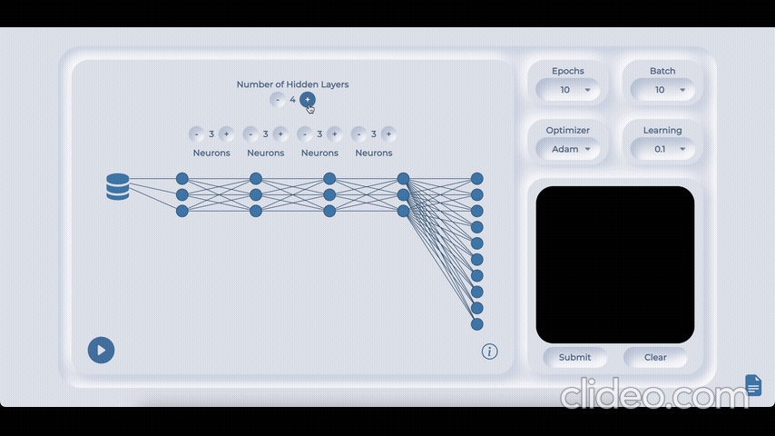
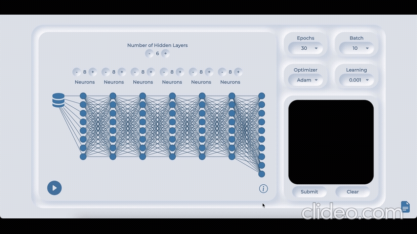

# Machine Learning Visualisation

The aim of this project was to develop an application that enables users to improve their understanding of Machine Learning concepts. It focused on the process and impact of model optimisation, through visualisation and interaction. 


## Features

- Dynamic Neural Network Illustration - Used to configure Neural Network.



- Live Accuracy Graph - Incorporated to display accuracy readings of machine learning model whilst training. 


- Interactive Canvas - Featured to Evaluate Model. 



## Tech Stack

**Client:** HTML, CSS, JavaScript (Chart.js & D3.js)

**Server:** Flask, Python (3.8+), TensorFlow, NumPy

Operating System: macOS Big Sur+


## Virtual Environment

To isolate your project's dependencies and avoid conflicts with other projects, create a virtual environment:

```bash
python -m venv venv
source venv/bin/activate
```
## Installation

Install the required Python libraries via `pip`:

```bash
  pip install -r requirements.txt
```
    
## Deployment

To deploy this project run

```bash
  python app.py
```


## Authors

- [@amanashraf](https://www.github.com/)

